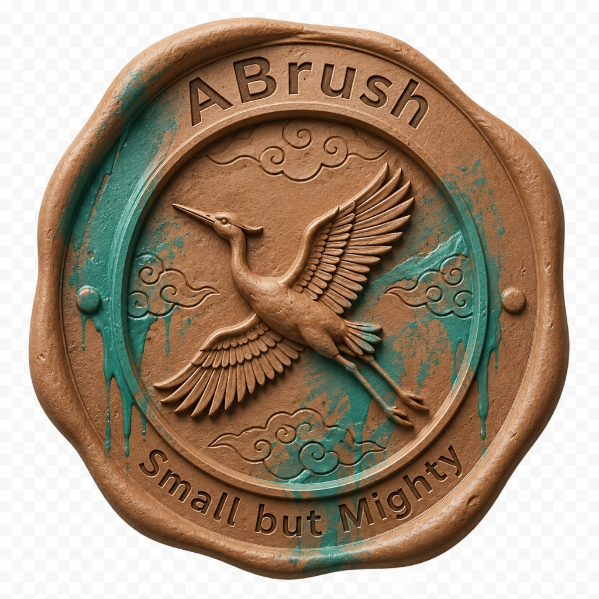
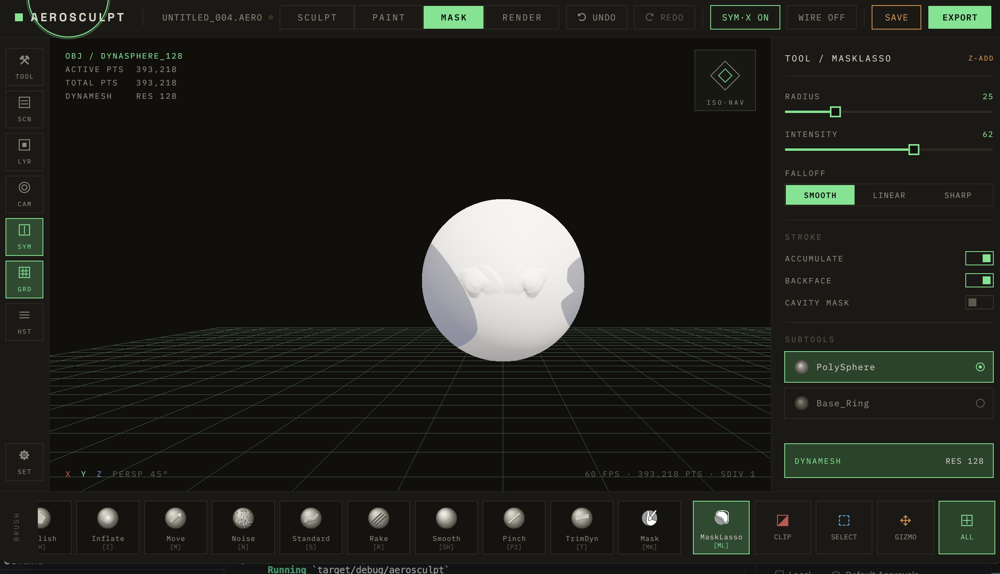
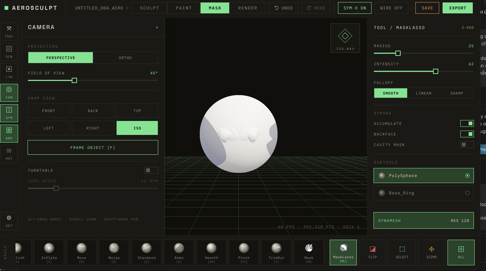
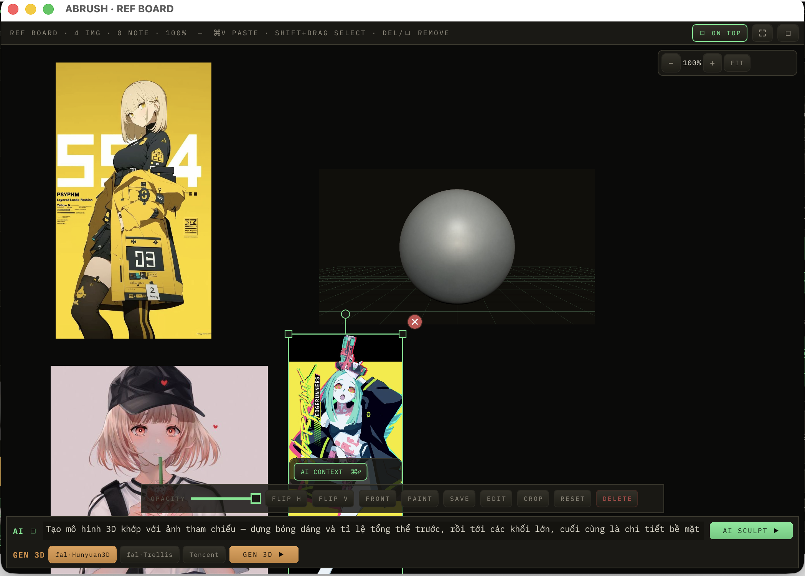
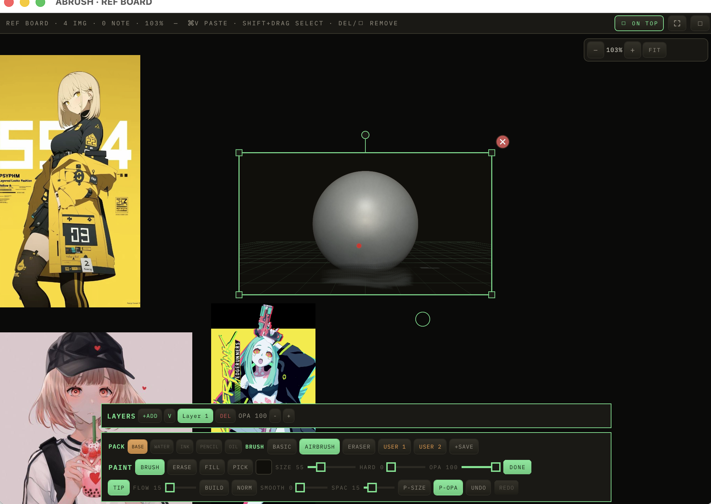
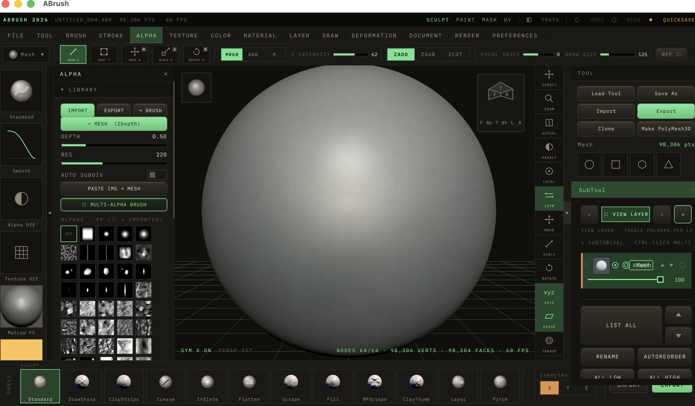

  

<h1 align="center">ABrush</h1>

  <strong>Phần mềm điêu khắc 3D nhẹ, nhanh và trực quan.</strong> 
  Tập trung vào trải nghiệm sculpt tự nhiên để bạn dành nhiều thời gian hơn cho sáng tạo.

  <a href="#tải-và-cài-đặt">Tải ABrush</a> ·
  <a href="aero-sculpt/aero-sculpt-docs/USAGE.md">Hướng dẫn sử dụng</a> ·
  <a href="aero-sculpt/ROADMAP.md">Lộ trình phát triển</a>

---

## Giới thiệu

**ABrush** (tên dự án: **AeroSculpt**) là phần mềm điêu khắc 3D dành cho nghệ sĩ, nhà thiết kế nhân vật và người sáng tạo nội dung số. Ứng dụng được xây dựng bằng Rust với mục tiêu mang đến hiệu năng tốt, phản hồi nhanh và giao diện gọn gàng trên máy tính cá nhân.

ABrush phù hợp cho quá trình dựng hình high-poly, tạo khối hữu cơ, thêm chi tiết bề mặt và chuẩn bị lưới low-poly bằng retopology thủ công. Phần mềm hỗ trợ cả chuột lẫn bảng vẽ có nhận diện lực nhấn.

> **Miễn phí trong giai đoạn phát triển:** ABrush hiện được cung cấp miễn phí, không quảng cáo, không giới hạn thời gian dùng thử và không khóa tính năng.

## Giao diện

  
  

  
  

  

## Tính năng nổi bật

- **Sculpt high-poly:** tạo hình hữu cơ và chi tiết bề mặt trên lưới có mật độ cao.
- **DynaMesh / Voxel Remesh:** tái tạo lưới nhanh để tiếp tục điêu khắc mà không bị giới hạn bởi topology ban đầu.
- **Sculptris Pro:** tự động bổ sung mật độ lưới tại khu vực đang thao tác.
- **Polygroup:** phân nhóm và quản lý từng phần của mô hình bằng màu sắc.
- **Retopology thủ công:** tạo lưới low-poly sạch cho game, animation và các quy trình 3D khác.
- **Hơn 20 loại cọ và 21 MatCap:** chuyển đổi nhanh bằng Pie Menu ngay tại vị trí con trỏ.
- **Hỗ trợ bảng vẽ:** nhận diện lực nhấn từ bút Wacom và các thiết bị tương thích.
- **Nhập và xuất OBJ:** hỗ trợ dữ liệu vertex color để giữ lại màu và Polygroup.

## Tải và cài đặt

Phiên bản hiện tại: **ABrush 0.9.0**

| Hệ điều hành | Kiến trúc | Bộ cài |
| --- | --- | --- |
| macOS | Apple Silicon (ARM64) | [Tải ABrush cho macOS (.dmg)](https://github.com/aerovfx/AeroScultptWorks/raw/refs/heads/main/dist/ABrush-0.9.0-4c96cce-dirty-macos-arm64.dmg) |
| Windows | 64-bit (x86_64) | [Tải ABrush cho Windows (.msi)](https://github.com/aerovfx/AeroScultptWorks/raw/refs/heads/main/dist/windows/ABrush-0.9.0-4c96cce-dirty-win64.msi) |
| Windows | 64-bit (x86_64) — bản chạy trực tiếp | [Tải ABrush cho Windows (.exe)](https://github.com/aerovfx/AeroScultptWorks/raw/refs/heads/main/dist/windows/abrush.exe) |

### macOS

1. Tải và mở file `.dmg`.
2. Kéo **ABrush** vào thư mục **Applications**.
3. Mở ABrush từ Applications.

Nếu macOS chặn ứng dụng ở lần mở đầu tiên, vào **System Settings → Privacy & Security**, kiểm tra đúng tên ứng dụng rồi chọn **Open Anyway**.

### Windows

1. Tải và chạy file `.msi`.
2. Làm theo các bước trong trình cài đặt.
3. Mở ABrush từ Start Menu hoặc shortcut trên Desktop.

Nếu Windows SmartScreen hiển thị cảnh báo, hãy kiểm tra đúng tên và nguồn tải của bộ cài trước khi chọn **More info → Run anyway**.

Xem thêm [hướng dẫn cài đặt đầy đủ](aero-sculpt/aero-sculpt-docs/INSTALLATION.md).

## Bắt đầu nhanh

- Dùng chuột hoặc bút để điêu khắc trực tiếp trên mô hình.
- Nhấn `Space` hoặc `Tab` để mở Pie Menu và đổi cọ nhanh.
- Dùng `Ctrl + Z` để hoàn tác và `Ctrl + Y` để làm lại.
- Tham khảo [hướng dẫn sử dụng](aero-sculpt/aero-sculpt-docs/USAGE.md) và [danh sách phím tắt](aero-sculpt/aero-sculpt-docs/SHORTCUTS.md) để làm quen với quy trình làm việc.

## Tài liệu

- [Hướng dẫn cài đặt](aero-sculpt/aero-sculpt-docs/INSTALLATION.md)
- [Hướng dẫn sử dụng](aero-sculpt/aero-sculpt-docs/USAGE.md)
- [Phím tắt và thao tác](aero-sculpt/aero-sculpt-docs/SHORTCUTS.md)
- [Định dạng file hỗ trợ](aero-sculpt/aero-sculpt-docs/abrush_file_format/FORMATS.md)
- [Lộ trình phát triển](aero-sculpt/ROADMAP.md)
- [Tài liệu API](aero-sculpt/aero-sculpt-api/README.md)
- [Tích hợp MCP](aero-sculpt/abrush-mcp/README.md)

## Trạng thái dự án

ABrush đang trong quá trình phát triển tích cực. Một số tính năng, định dạng file và giao diện có thể thay đổi giữa các phiên bản. Bạn nên sao lưu mô hình gốc trước khi sử dụng trong dự án quan trọng.

## Giấy phép

ABrush là phần mềm độc quyền, mã nguồn đóng. Việc tải xuống và sử dụng phần mềm đồng nghĩa với việc bạn đồng ý với [Thỏa thuận cấp phép người dùng cuối (EULA)](aero-sculpt/LICENSE.md).

Copyright © 2026 Đặng Việt Chung / [Aerovfx.com](https://aerovfx.com). All rights reserved.
